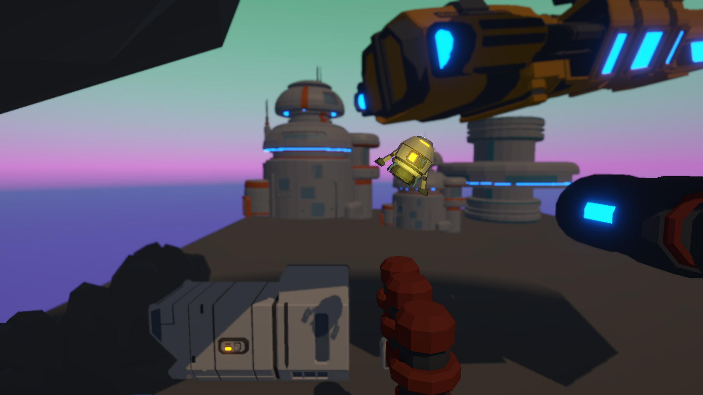
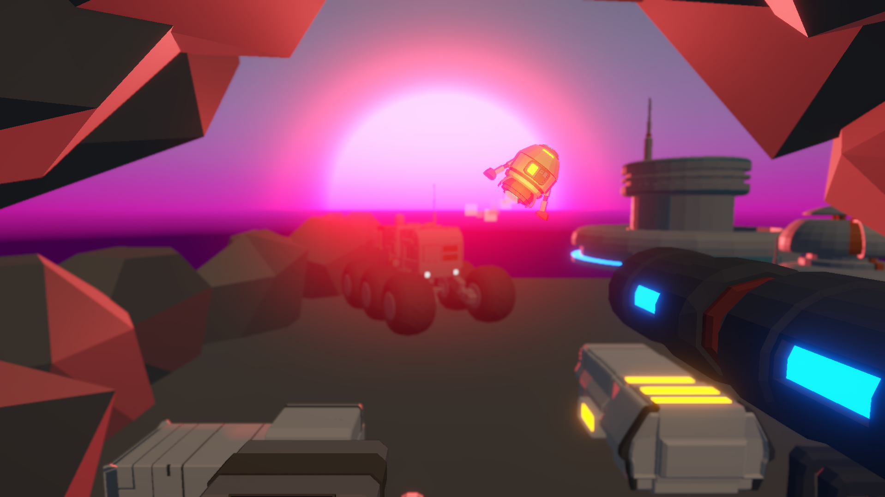

# 🚀 Rocket Boost

Rocket Boost is an exciting 3D game where you guide a rocket through various obstacles to safely land on the designated landing pad. Test your piloting skills and precision in this fun and challenging space adventure!

## 🎮 Gameplay
- Control a rocket and navigate through obstacles.
- Avoid collisions while maintaining stability.
- Successfully land on the designated pad to complete levels.

## 🖼️ Screenshots
Here are some in-game screenshots:

## 🛠️ Features
- **Smooth Controls**: Easy-to-learn controls for an enjoyable experience.
- **Challenging Levels**: Various obstacles to test your skills.
- **3D Graphics**: Immersive visuals with a fun and cartoony style.
- **Physics-Based Mechanics**: Realistic gravity and momentum.

## 📥 Link: 

## 🎯 Controls
- **Arrow Keys**: Steer the rocket.
- **Spacebar**: Apply thrust.
- **R**: Restart the level.
- **Exit**: Exit the game.

## 🏆 Credits
Developed by **Dhia Nabli**@**ByteJutsu**.

## 📌 License
This game is released under the MIT License. Feel free to modify and distribute.

---
Enjoy playing Rocket Boost! 🚀✨

